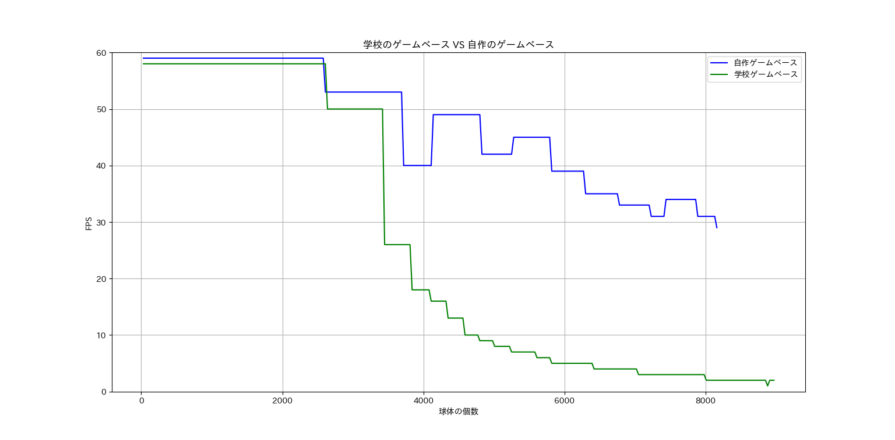
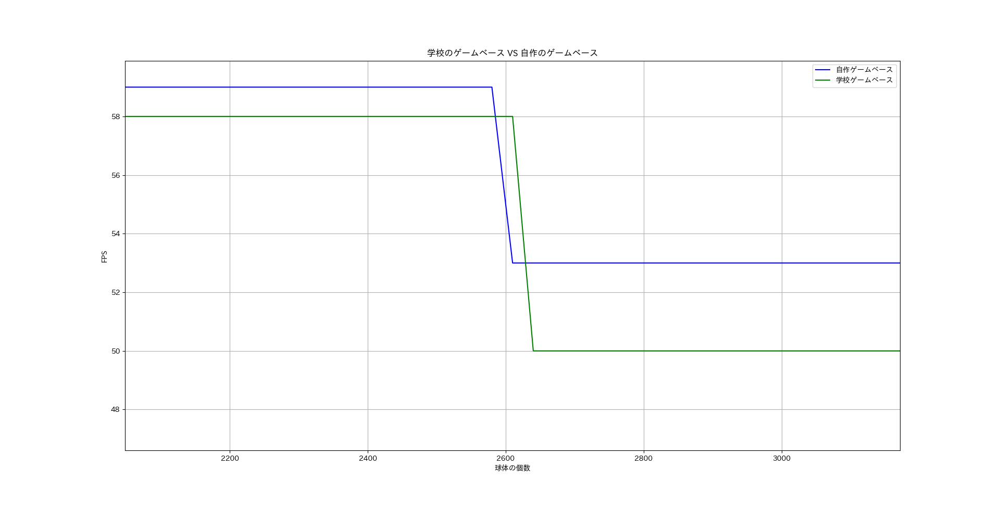
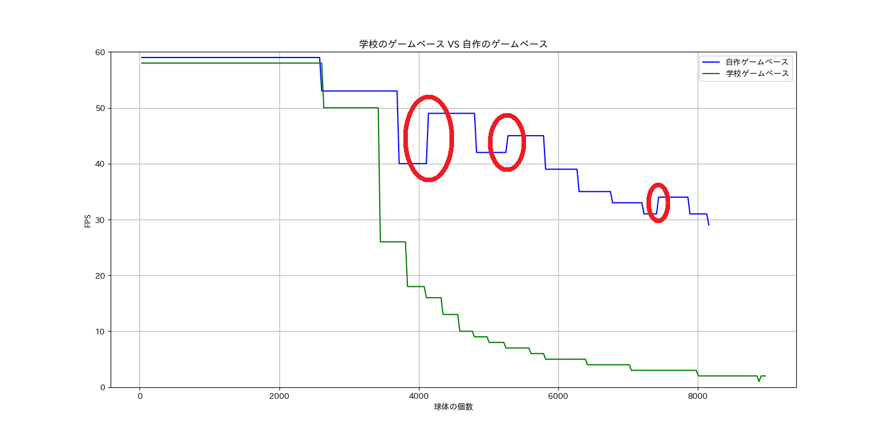
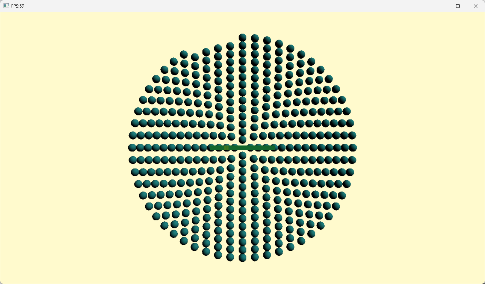
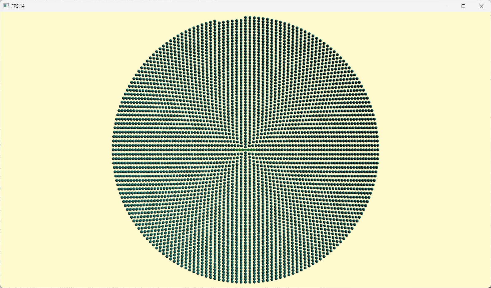
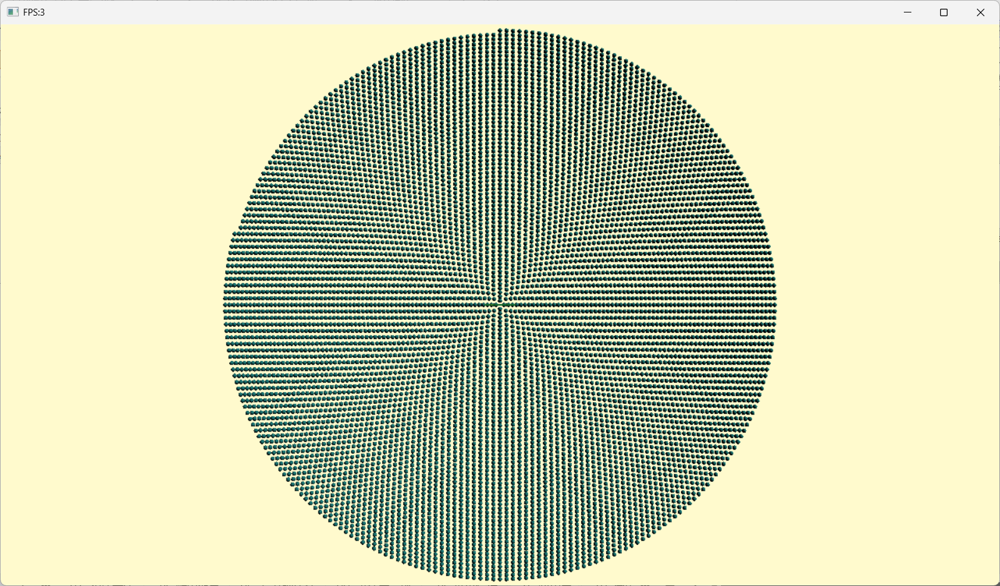
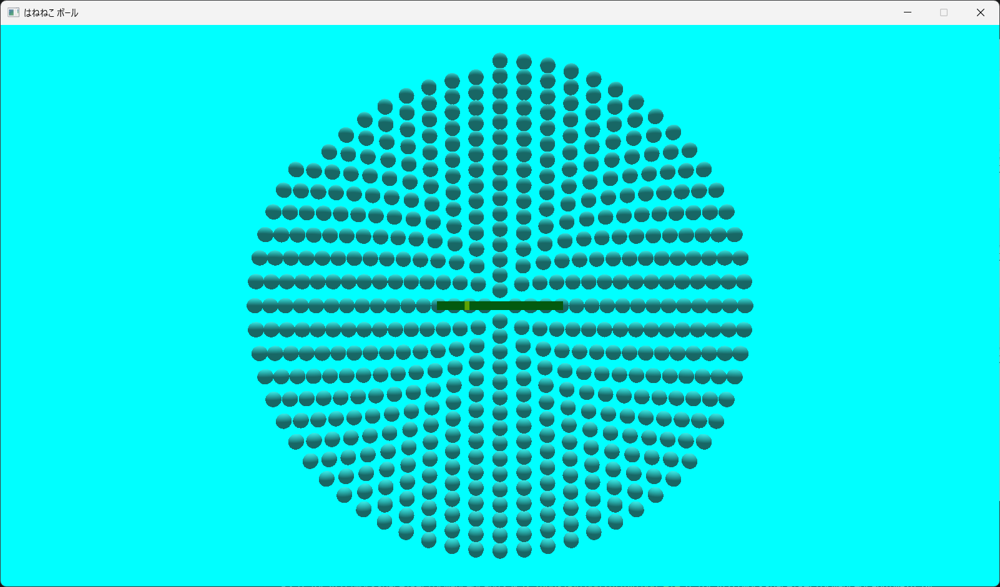
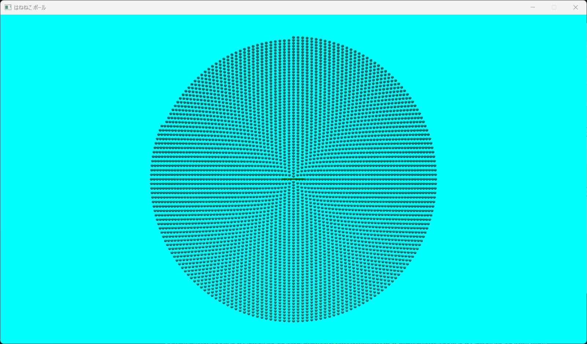
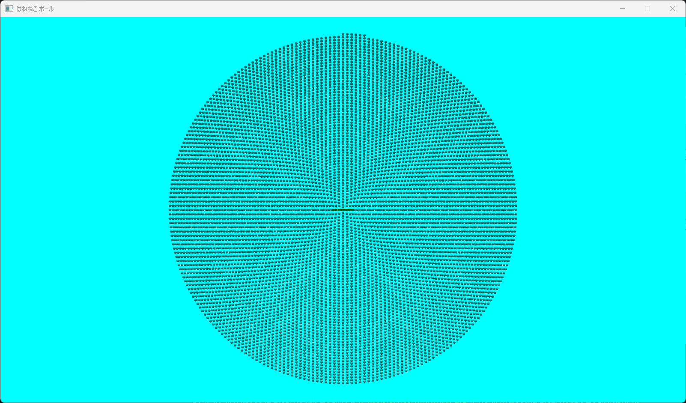

# PerformanceGraph

学校が提供しているゲームベースと、自作のゲームベースのパフォーマンス差分を  
グラフ化するためのPython プロジェクト。

## 環境

- Python 3.14.4
- 仕様ライブラリ
  - [matplotlib-fontja](https://github.com/ciffelia/matplotlib-fontja)
  - [matplotlib](https://matplotlib.org/)

## パフォーマンス計測対象

- C++ DirectX 11 で作成した はねねこボール のゲームベース
  - 以下「自作ゲームベース」
  - [はねねこボールのリポジトリ](https://github.com/3doriTea/SkyGameBase)
- C++ DirectX 11 での開発を手助けする学校のゲームベース
  - 以下「学校ゲームベース」
  - [学校ゲームベースをフォークしたリポジトリ](https://github.com/3doriTea/PerformanceTest)

## 計測

### 前提

- パフォーマンスとは、描画オブジェクトの数が増えても、FPS (1秒間にクライアント領域が描き変わる回数) が60を維持できるかを
  本プロジェクトでは評価対象する。
  - CPUの限界、最大限FPSを出すことは可能だが、人間が視認できると言われているFPS、  
  60を保つようにすることで、CPUの負荷を減らす。
  - パフォーマンスが下がる、FPSが下がるとプレイヤーの操作がゲーム内に反映されるまでラグが発生する。

### 計測前の予想

計測前に、予想を立てた。

- ECS設計を組み込んだため、自作ゲームベースは学校ゲームベースに比べて、緩やかな傾斜になる。
- 自作ゲームベースはコンポーネントプールに限りがあるため、オブジェクト総数が定数を超えるとエラーが発生する。

### 計測結果

- 球体の個数が2600個前後で開始時点のFPSを維持できなくなり、最初のFPS低下が始まった。  
  先に低下が始まったのは自作ゲームベースだった。

- 球体の個数が3700個を超えたあたりから急激にFPSが下がった。
- 自作ゲームベースには学校ゲームベースには見られない特徴として  
  球体の個数が増えていくとFPSが下がってから再び上がる箇所があった。

- 自作ゲームベースはコンポーネントプールの影響で、  
  オブジェクトの総数上限とした `8192`個を超えるとエラーが発生、  
  計測が途中で止まった。一方の学校ゲームベースはヒープ領域の限界まで  
  オブジェクトを増やすことができるため、計測を打ち切った。

### 計測結果を受けて

- 自作ゲームベースのECS設計の効果が現れていることを確認できた。
- しかし、開始時のFPSを維持できなくなるタイミングが、学校ゲームベースに比べ、  
  自作ゲームベースのほうが早い点は改良が必要だと考えた。
- 自作ゲームベースの特徴的なFPSの上昇について、原因を調査する必要がある。  
  現段階の知識では、CPUの分岐予測が影響しているのではないかと予想している。

### 計測方法と計測中の様子

#### 計測方法

球体のモデルを原点を中心に円形に配置していき、FPSを計測する。

#### 学校ゲームベース

#### 自作ゲームベース

